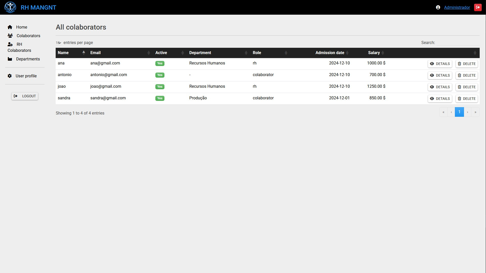

# RH MANGNT

**Description**  
RH MANGNT is a human resources management app created for study purposes. It allows the management of departments and employees, with the ability to associate employees to departments.

## Features
- Manage departments
- Manage employees and associate them to departments
- User authentication with 3 roles: Admin, HR User, Normal User

## Technologies Used
- Laravel 12
- MySQL
- PHP 8.2 or higher
- Fortify for authentication
- Blade with Bootstrap

## Setup Instructions

1. Clone the repository:
    ```bash
    git clone <repository_url>
    ```

2. Create a `.env` file from `.env.example`:
    ```bash
    cp .env.example .env
    ```

3. Run migrations:
    ```bash
    php artisan migrate
    ```

4. Seed the database:
    ```bash
    php artisan db:seed --class=AdminSeeder
    ```

5. Serve the application:
    ```bash
    php artisan serve
    ```

## Demo

